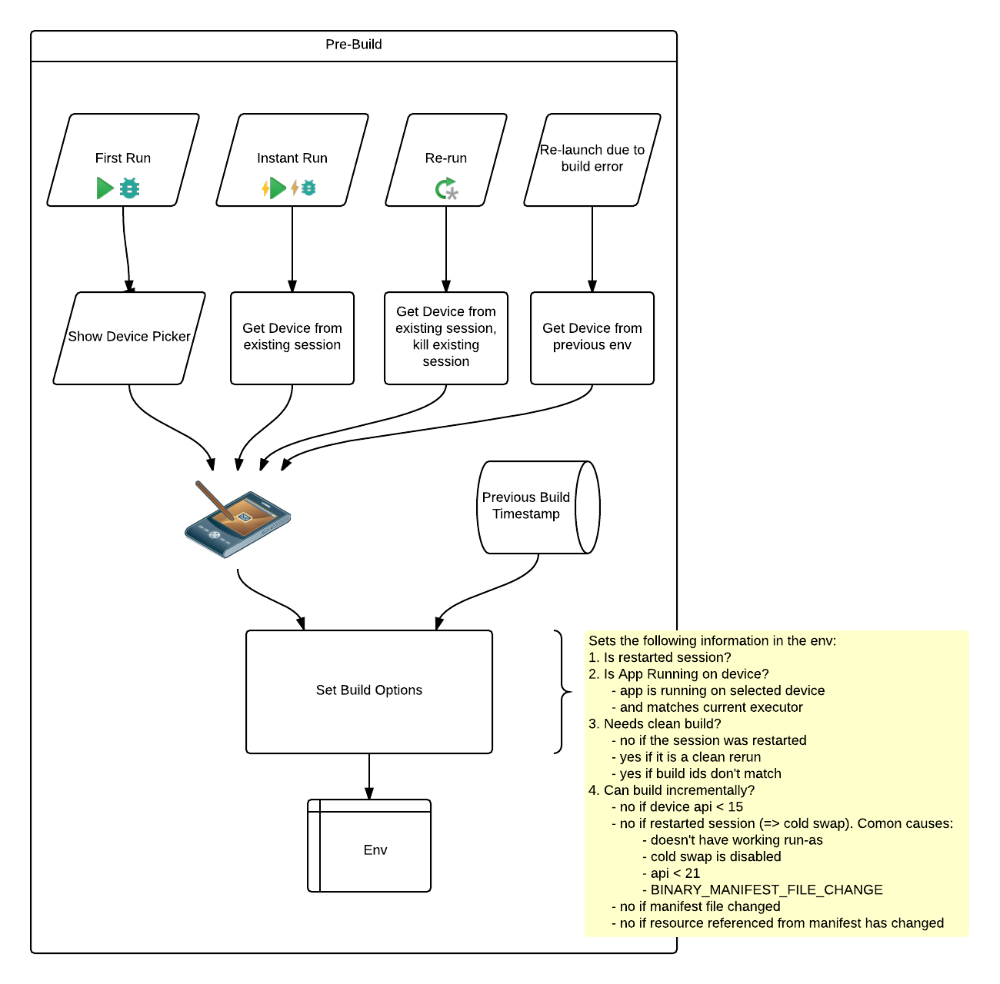
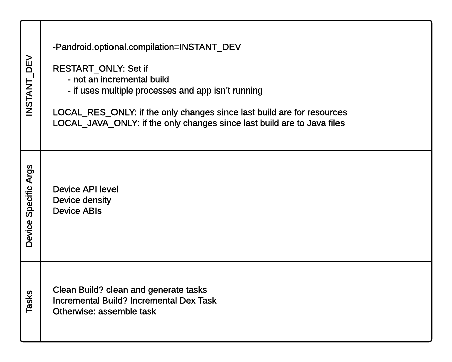
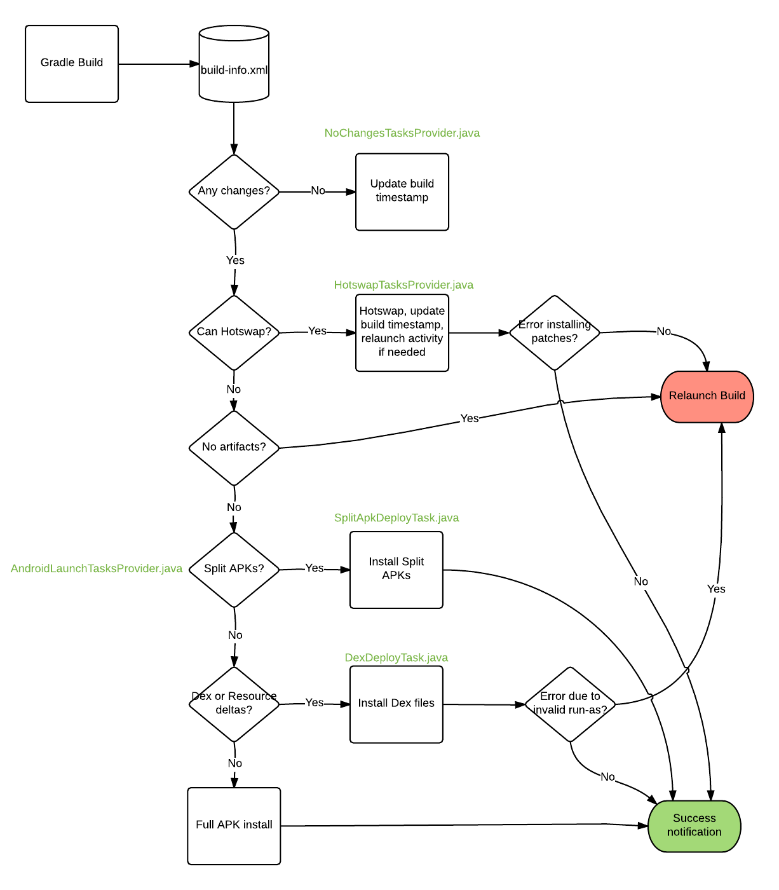

# Run Configurations

This document gives a quick overview of the various classes involved in launching applications.
While this document focuses mostly on the android plugin itself, parts of this code are also used by
the NDK and Bazel plugins to support other types of launches.

[TOC]

## References

IntelliJ has a short [overview](http://www.jetbrains.org/intellij/sdk/docs/basics/run_configurations.html)
of how run configurations work.

## Run Configuration UX

The android `plugin.xml` declares two configuration types: `AndroidRunConfigurationType` and `AndroidTestRunConfigurationType`.
The factory methods in those classes are used to instantiate an `AndroidRunConfiguration` or an `AndroidTestRunConfiguration` respectively.
These represent a single run configuration that is configured by the user. The `getConfigurationEditor` method in these run configurations
returns the settings editor that defines the UX. The `AndroidRunConfigurationEditor` also has a configuration specific panel so that
some clients can customize just a few things (e.g. launching an activity in run config vs launching tests in the test config).

### UX Extensions

The run configuration editor supports a number of different options that a user can configure. For instance, the `General` tab includes
the following options:

 * Installation Options that control how the artifact should be installed
 * Launch Options control how the application should be launched
 * Deployment Target Options control where the application should be installed and launched

For each of these options (potentially defined in a 3rd party plugin), we need to be able to do two things:

 * save/restore the state corresponding to the user choices
 * allow custom UX for each of the individual choices

This is achieved using a simple pattern: Every option is required to provide:

 * a simple `State` object that corresponds to the data that reflects user settings. This object is serialized/deserialized by the
   infrastructure.
 * a `Configurable` object that can provide a `JComponent` that corresponds to the UX for this option.

The infrastructure then picks up all the options, and shows a combo box that allows the user to pick one of the options,
and for the selected option, it displays the configurable UX inside a `ConfigurableCardPanel`

This pattern is used widely. For example, `DeployTargetProvider` is an extension point that has two methods: `createState` and
`createConfigurable`. The first method returns the state that is saved for each of the deploy target providers, and the second one
returns the configurable that displays the custom UX.

### Deployment Target Selection

Initially, all the deployment targets were local devices (emulators or devices). The [Cloud Test Lab](https://developers.google.com/cloud-test-lab/?hl=en)
however adds a new complication: the devices can now not be present locally at all. This leads to the presence of
the `DeployTargetProvider` interface. This interface abstracts away the target of the deployment by returning a `DeployTarget` object,
which is pretty simple: either it handles the entire execution flow itself (`DeployTarget.getRunProfileState`), or it
points to a set of local devices  (`DeployTarget.getDevices`)

### AVDs as deploy targets

A deployment target may sometimes not be online as yet as in the case of an emulator that is not running, but selected by the user
as the target of the launch. In such a case, the application launch flow proceeds in parallel with the emulator being started.
In order to handle this scenario, local devices are wrapped by the `DeviceFutures` class, which indicates that the device
may only be ready sometime in the future. The local devices are either connected via USB (`IDevice`), or an emulator that has been
started (`Future<IDevice>`). Since the build process sometimes requires device info before it is available, both types of devices
are wrapped in an `AndroidDevice` which allows access to properties of an offline emulator by obtaining the properties from the
`AVDInfo` class.

## Run Configuration Execution Flow

The following steps are taken to actually perform a launch:

1. User first selects a particular configuration. This would be an instance of `AndroidRunConfiguration` (which implements `RunProfile`).
2. She then clicks on Run/Debug or Profile, each of which corresponds to a different `Executor`.
3. A `ProgramRunner` is selected based on the above two (configuration + executor). The android plugin defines a `AndroidProgramRunner`,
   which is very simple and mostly just ends up calling the run state. (The infrastructure chooses the first runner that `canRun` the given
   configuration state and executor.
4. An `ExecutionEnvironment` is created, and the `ProgramRunner.execute()` is called.
     1. This results in a call to `RunProfile.getState()`, which maps to `AndroidRunConfiguration.getState()`:
     2. We do a bunch of checks, then pick a device to deploy to, extract other necessary parameters and return a `RunProfileState`.
        (IntelliJ docs suggest that the returned `RunProfileState` object should describe a process about to be started.
        At this stage, the command line parameters, environment variables and other information required to start the process is initialized).
        In the android plugin, the returned state may be:
          1. `AndroidRunState` if this we are deploying to a local device
          3. One of the various Cloud launch specific states if deploying to the cloud.
     3. `ExecutionManager.startRunProfile` ends up calling `compileAndRun`
          1. We look at the `BeforeRunTask` instances registered on the run configuration.
          2. All the `BeforeRunTask`'s are executed on a pooled thread, and once they are done, the run process continues again on the EDT
     4. Back again on the EDT, the `ExecutionManager` performs the following:

```java
          final RunContentDescriptor descriptor = starter.execute(project, executor, state, environment.getContentToReuse(), environment);
          environment.setContentToReuse(descriptor);
          myRunningConfigurations.add((descriptor, env.getRunnerAndConfigurationSettings(), executor));
          Disposer.register(descriptor, () -> {myRunningConfigurations.remove(trinity);});
          getContentManager().showRunContent(executor, descriptor, environment.getContentToReuse());
          final ProcessHandler processHandler = descriptor.getProcessHandler();
          processHandler.startNotify();
          processHandler.addProcessListener(new ProcessExecutionListener(project, profile, processHandler));
```

5. The first step in the above snippet (`starter.execute`) results in the ProgramRunner's execute method being called.
   In the case of '`AndroidDebugRunner.doExecute()`, we simply end up calling `super.doExecute()`
6. Finally, we call `AndroidRunningState.execute`. IntelliJ docs say that the `RunProfileState.execute` method "starts the process,
   attaches a ProcessHandler to its input and output streams, creates a console to display the process output, and returns an
   `ExecutionResult` object aggregating the console and the process handler." In the Android plugin, we do pretty much the same thing,
   except that actually starting the process is moved to a separate pooled thread. This means that all error conditions will have to
   be communicated via the process handler..

## Android Run Configuration Execution Flow

The previous section talked about the overall execution flow. In this section, we look at the specific parts implemented within the android
plugin. Overall, there are 3 parts to this:

1. User presses Run/Debug. At this point, `AndroidRunConfigurationBase.getState` is called, and it constructs and returns
an `AndroidRunState`
2. The Gradle build is performed.
3. Once the build is complete, the actual deployment is performed by the `AndroidRunState.execute` method.

The first two are fairly straightforward, see the respective classes. The 3rd part is also straightforward, but keep in mind that it is
shared by the Blaze plugin as well, so it is important to not make assumptions about the type of project there.

At a high level, `AndroidRunState.execute` obtains the list of `LaunchTask`s to execute, and runs them sequentially in a background task.
A console (what you see in the Run/Debug toolwindow) is created, along with a `ProcessHandler`. The console is used to display the output
from the launch tasks. The `ProcessHandler` is a proxy for the Android application that will eventually be launched once the launch tasks
are complete. Until then, it is a proxy for the `LaunchTasksRunner` itself. Users can use the stop button on the console to kill the process
handler, or one of the launch tasks may terminate the launch process (in case of an error) by terminating the process handler.

### Waiting for devices to be launched

When running an application, users may choose to deploy it to an emulator(s). The emulators that are not running are launched. The
gradle build and the launch flow continues in parallel with the emulator launch. In order to achieve this (allowing the launch to continue
while the device doesn't yet exist), `AndroidRunConfigurationBase` wraps the target set of devices in a `DeviceFutures` class.
When `LaunchTasksRunner` eventually reaches a stage where it requires the device, it simply waits on these futures to complete.
This allows monitoring of both failures in the emulator launch, or terminating the run config launch if the user cancels the operation.

### Launch Tasks

The list of launch tasks (e.g. install app, launch activity) used to be hard coded. This mechanism doesn't scale as the list of tasks
became configurable. Now, each task is represented by a single `LaunchTask` interface. The `LaunchTask.perform` method receives:

 * a device on which the task should be performed.
 * The `LaunchStatus` that allows the task to terminate the entire launch process, or inspect whether the launch has been terminated
 * The `ConsolePrinter` allows the task to print its output on the console.

### Obtaining the list of tasks

The list of launch tasks are obtained through the `LaunchTasksProvider`. Typically, this class would just need the information from the
run configuration UX to determine the list of tasks requested by the user. However, Instant Run complicates this a little bit, and requires
examining the build output. `LaunchTasksProviderFactory` adds a level of indirection and allows for first examining the build outputs,
and then constructing the appropriate `LaunchTasksProvider`.

### Connecting the debugger

There is one special task outside of the `LaunchTask` interface, and that is the `ConnectDebuggerTask`. This task is only present when
using the debug executor, and in such a case, the launch is specific to a single device. When present, this is always the last task
executed as part of the launch flow. Launching the debugger itself is fairly straightforward: it first waits for the application to start,
and then launches the appropriate debugger (Java or native). The reason why this task falls outside of the other `LaunchTask`s is that
when using the debugger, the existing `ProcessHandler` that was connected to the console needs to be switched to point to the new
`DebugProcessHandler` which actually monitors the debugger instead of the remote process. The existing output on the console also needs
to be replayed to the new process handler so that the console still has all the output.

## Running tests
 * Execute shell command: `am instrument ...` command. (See `RemoteAndroidTestRunner`)
 * Parse the output from the shell command (`InstrumentationResultParser`), construct appropriate events (`AndroidTestListener`) and pass it on to IJ framework
 * IJ parses the rewritten output from the console (`GeneralToSMTRunnerEventsConvertor`) and updates the test tree UX

## Instant Run
 * Hot swap: push the incremental changes (as a dex file) to the running app, restart activity alone
 * Cold swap: push the changes to the running app, then restart the entire process
 * Freeze swap (aka dex swap): app doesn't have to run, push changes via adb, then launch the process

### Pre Build
 * See 
 * First determines the previous device on which the launch took place.
 * Examines if the build on the device matches the build on disk
 * Examines if the app is still running
 * Examines the state of the changes on disk
 * Saves all this information in the execution environment so that the build step can use this information.
 * See methods in [AndroidRunConfigurationBase](AndroidRunConfiguration.java): `getFastDeployDevices`, `setInstantRunBuildOptions`

### Build options
 * See 
 * The build step looks at all the information from the previous phase, and determines:
   * Which build task to execute (full build vs incremental build)
   * Set of flags to pass to Gradle
   * See `GradleInvokerOptions.create`

### Post Build
 * See 
 * Examine the build-info.xml file to figure out what actually happened (See `AndroidLaunchTasksProviderFactory`)
 * Determine the appropriate task to use based on the build result.
   * See `AndroidLaunchTasksProvider` and `HotswapTasksProvider`
